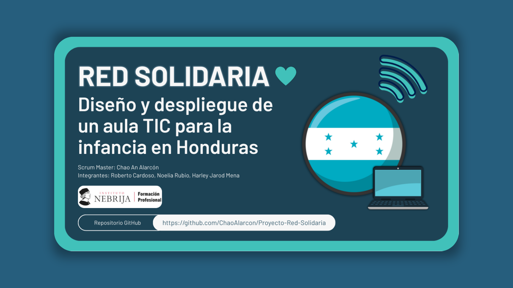

# Proyecto-Red-Solidaria

## Integrantes:
#### - Roberto Cardoso
#### - Noelia Rubio
#### - Harley Jarod Mena
#### - Chao An Alarcón 

### Escenario del Proyecto:
Una ONG ha contactado con tu equipo para diseñar un aula de formación digital para niños 
y niñas en una zona rural de Honduras. El objetivo es dotar de infraestructura y recursos 
digitales a una escuela con limitaciones económicas y tecnológicas. Como estudiantes del 
ciclo superior de DAM, deberéis aplicar vuestros conocimientos sobre redes, sistemas, 
ciberseguridad y trabajo colaborativo para llevar a cabo este proyecto. 
